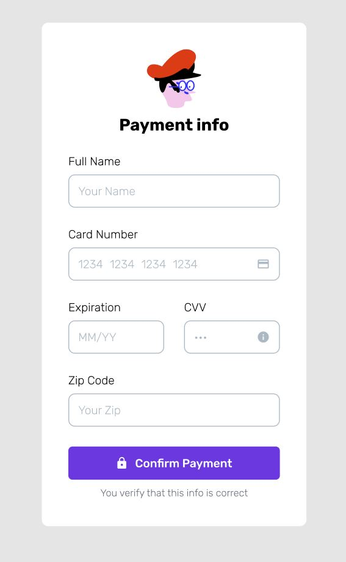
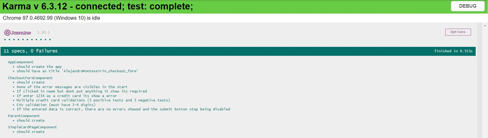

# Prueba_tecnica_angular-Checkout_form

## Description
In this challenge, you are asked to develop the payment gateway shown above.
In addition, it is also requested to perform a validation to see that the card format has the correct format and make sure the component is fully testable.
If developed in with react it is fully mandatory to use Typescript as it is required in order to fulfill the position requirements.

## Project question 
At the end of the project readme, include a brief explanation of the project's architecture and how would you structure the code Also, if it was part of a bigger project with views, internationalization, tests, and shared components how would this project be structured and where would the reusable component be placed.

### Question response:

If it was part of a bigger project with views, I see 3 possible approaches to connect the independent and reusable component "checkout-form":

1. Connecting the component to its parents and manage the data in the parent. The checkout-form component could be connected in any place using @Input @Output annotations to send the data to the parent components.

2. If the component needs to be connected without relation with its parents, the inputs and outputs should be replaced for a Service who connects the component to the others which have the logic to manage the data.

3. If the application needed it for any reason, it is also possible to use a behavior subject in the component, which sends the data and subscriptions which receive and manage the data.

In this example, I used the first approach. The component "checkout-form" is connected to the parent component "simple-card-page" which is a simple component that contain the card CSS and just print the information received in a console.log(), when the "checkout-form" component submit it successfully.

For internationalization in Angular, I have used the package "ngx-translate" which works really well, and I already have experience with it.

Regarding the Tests, I choose Karma Jasmine for testing every functionality, especially the inputs, the validations and the submit of data. 

### Test results:

### Firebase deploy
https://angular-pruebatecnica-alex-m-p.web.app/